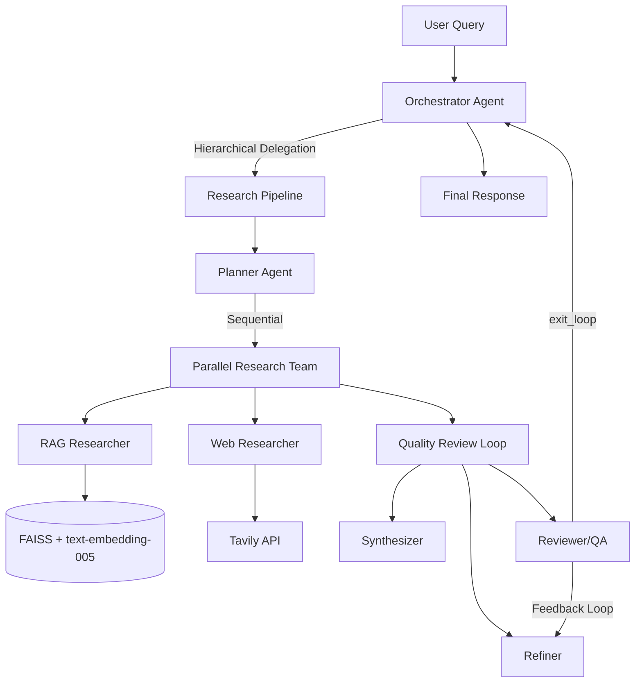

# Multi-Agent Research Intelligence System

A production-ready research assistant built with **Google Agent Development Kit (ADK)**, combining RAG over academic papers, real-time web search (Tavily), multi-agent orchestration, observability, and a Streamlit UI — deployable to **Google Cloud Run**.

**GCP Project:** `multi-agent-research-system`

## Architecture



## Features

| Requirement | Implementation |
|---|---|
| **Multi-Agent (3+)** | Orchestrator, Planner, RAG Researcher, Web Researcher, Synthesizer, Reviewer |
| **Communication Patterns** | Sequential, Parallel, Hierarchical, Feedback Loop |
| **RAG** | PDF extraction → semantic chunking → Vertex AI `text-embedding-005` → FAISS |
| **Web Search** | Tavily API with intelligent RAG vs Web vs Hybrid routing |
| **Custom Tools** | `search_knowledge_base`, `search_web`, `format_citations`, `get_system_metrics` |
| **Observability** | structlog JSON logging, in-memory metrics, optional Cloud Trace |
| **UI** | Streamlit chat interface with PDF upload & ingestion |
| **Deploy** | Cloud Run via `adk deploy` or Cloud Build |

## Quick Start

### 1. Prerequisites

- Python 3.10+
- Google Cloud project with Vertex AI API enabled
- Application Default Credentials: `gcloud auth application-default login`
- Tavily API key from [tavily.com](https://tavily.com)

### 2. Setup

```powershell
cd C:\Users\dinaz\Projects\multi-agent-research-system
python -m venv .venv
.venv\Scripts\Activate.ps1
pip install -r requirements.txt
copy .env.example .env
# Edit .env with your TAVILY_API_KEY
```

### 3. Add Papers & Ingest

Place academic PDFs in `data/papers/`, then:

```powershell
python scripts/ingest_documents.py
```

### 4. Run ADK Web UI (development)

```powershell
adk web --port 8000
```

Open http://localhost:8000 and select `research_agent`.

### 5. Run Streamlit UI

```powershell
streamlit run streamlit_app/app.py
```

Open http://localhost:8501

## Agent Communication Patterns

1. **Sequential Flow** — `research_pipeline`: Planner → Parallel Research → Quality Loop
2. **Parallel Execution** — `parallel_research_team`: RAG + Web researchers run concurrently
3. **Hierarchical Delegation** — `orchestrator` delegates to `research_pipeline` sub-agent
4. **Feedback Loop** — `quality_review_loop`: Synthesize → Review → Refine until QA approves

## RAG vs Web Search Routing

The system intelligently routes queries:

| Query Type | Source | Example |
|---|---|---|
| Paper content, methodology | RAG | "What methodology did Smith use?" |
| Latest citations, news | Web | "Latest papers on transformer attention 2025" |
| Comprehensive review | Hybrid | "Compare BERT variants with recent improvements" |

## Observability

- **Structured logs**: JSON via `structlog` (agent events, tool calls, latencies)
- **Metrics**: Query counts by source, avg latency, review iterations
- **Cloud Trace**: Set `ENABLE_CLOUD_TRACE=true` in `.env`

## Deploy to Cloud Run

### Option A: ADK CLI (recommended)

```bash
export GOOGLE_CLOUD_PROJECT=multi-agent-research-system
export GOOGLE_CLOUD_LOCATION=us-central1
export GOOGLE_GENAI_USE_VERTEXAI=True

# Create Tavily secret
echo "YOUR_TAVILY_KEY" | gcloud secrets create TAVILY_API_KEY \
  --project=multi-agent-research-system --data-file=-

bash scripts/deploy.sh
```

### Option B: Cloud Build

```bash
gcloud builds submit --config cloudbuild.yaml --project multi-agent-research-system
```

### Option C: Streamlit on Cloud Run

```bash
gcloud run deploy research-streamlit \
  --source . \
  --dockerfile Dockerfile.streamlit \
  --region us-central1 \
  --project multi-agent-research-system \
  --set-env-vars GOOGLE_CLOUD_PROJECT=multi-agent-research-system,GOOGLE_GENAI_USE_VERTEXAI=True \
  --set-secrets TAVILY_API_KEY=TAVILY_API_KEY:latest \
  --memory 2Gi --timeout 300
```

## Project Structure

```
multi-agent-research-system/
├── research_agent/          # ADK agent package (Cloud Run entry)
│   ├── agent.py             # root_agent + workflow composition
│   ├── agents/              # Specialized agent definitions
│   ├── tools/               # RAG, web search, custom tools
│   ├── rag/                 # PDF → chunk → embed → FAISS pipeline
│   └── observability/       # Logging, metrics, tracing
├── streamlit_app/           # Streamlit UI
├── scripts/                 # Ingestion & deploy scripts
├── data/papers/             # Academic PDF knowledge base
├── vector_store/            # FAISS index (generated)
├── Dockerfile               # ADK API server for Cloud Run
└── cloudbuild.yaml          # CI/CD deployment
```

## GCP Setup Checklist

```bash
gcloud config set project multi-agent-research-system

# Enable APIs
gcloud services enable \
  aiplatform.googleapis.com \
  run.googleapis.com \
  cloudbuild.googleapis.com \
  secretmanager.googleapis.com \
  artifactregistry.googleapis.com

# Grant Cloud Build permissions
gcloud projects add-iam-policy-binding multi-agent-research-system \
  --member="serviceAccount:$(gcloud projects describe multi-agent-research-system --format='value(projectNumber)')-compute@developer.gserviceaccount.com" \
  --role="roles/cloudbuild.builds.builder"
```

## License

Apache 2.0
